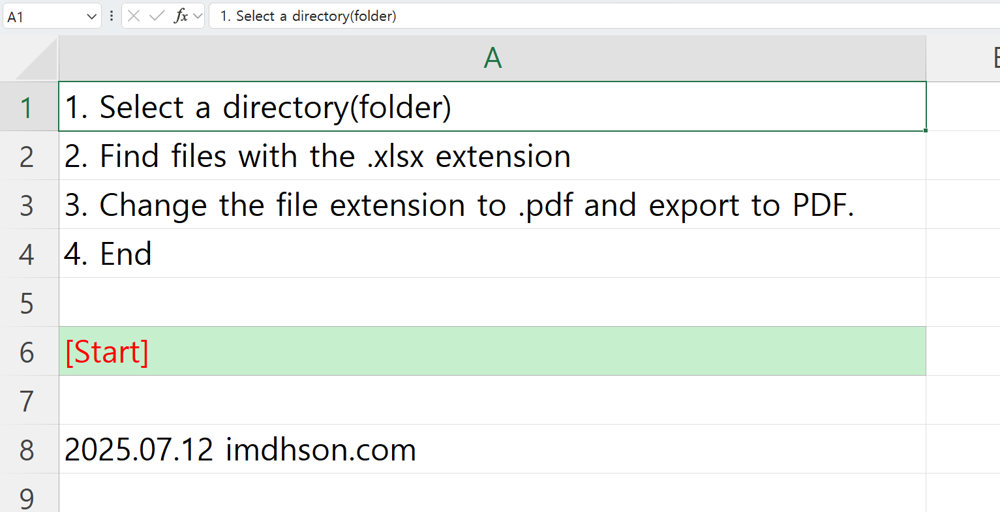

# Excel 일괄 PDF 변환 도구 | xlsx to PDF Batch Converter

## 📥 **다운로드**

[](xlsx_To_PDF[imdhson].xlsm)

[](https://github.com/imdhson/xlsx-to-pdf-converter/releases/latest)

**💾 파일명:** `xlsx to PDF[imdhson].xlsm` • **📊 Excel 매크로 파일** • **🔒 안전한 로컬 변환**

---



## 소개

**[English readme.md](README_EN.MD)**

Excel XLSX 파일을 PDF로 일괄 변환하는 VBA 매크로 도구입니다. 온라인 변환 툴의 개인정보 유출 우려와 속도 문제를 해결하고, Excel 자체의 공식 PDF 변환 기능을 활용하여 로컬 환경에서 안전하고 빠르게 다중 파일을 처리할 수 있습니다.

## 개발 배경
- 온라인 PDF 변환 툴의 개인정보 보안 우려 해소
- 로컬 환경에서의 빠른 일괄 변환 처리
- Excel 공식 변환 기능 활용으로 의존성 문제 최소화
- 다중 파일 처리의 효율성 증대

## 설치 및 구성

### 1. 요구사항
- Microsoft Excel (매크로 지원 버전)
- Windows 운영체제

### 2. 파일 다운로드
위의 **다운로드** 버튼을 클릭하여 [`xlsx to PDF[imdhson].xlsm`](xlsx_To_PDF[imdhson].xlsm) 파일을 다운로드합니다.

### 3. 매크로 활성화
Excel에서 파일을 열 때 매크로 실행을 허용해주세요.

### 4. 사용 준비
Excel 파일을 열고 **[시작하기]** 셀을 클릭하면 변환 프로세스가 시작됩니다.

## 주요 기능

- **일괄 변환**: 선택된 폴더 내 모든 XLSX 파일을 한 번에 PDF로 변환
- **로컬 처리**: 인터넷 연결 없이 로컬 환경에서 안전하게 처리
- **Excel 공식 변환**: `ExportAsFixedFormat` 함수를 사용한 고품질 변환
- **간편한 인터페이스**: 셀 클릭만으로 실행되는 직관적인 사용법
- **자동 파일명 생성**: 원본 파일명에서 확장자만 변경하여 PDF 생성

## 사용 방법

### 1. 변환 시작하기
1. `xlsx to PDF[imdhson].xlsm` 파일을 Excel로 열기
2. **[시작하기]** 셀을 클릭
3. 폴더 선택 대화상자에서 변환할 XLSX 파일들이 있는 폴더 선택

### 2. 변환 과정
- 선택된 폴더에서 모든 `.xlsx` 파일을 자동 검색
- 각 파일을 순차적으로 열어 PDF로 변환
- 동일한 폴더에 같은 이름의 PDF 파일 생성
- 변환 완료 시 알림 메시지 표시

### 3. 주의사항
- **하위 폴더는 지원하지 않음**: 선택된 폴더 자체의 파일만 변환
- 변환 중에는 Excel 화면 업데이트가 비활성화됨 (성능 향상)

## 핵심 VBA 코드

### 메인 변환 함수
```
Sub Batch_Export_XLSX_to_PDF()
    Dim folderPath As String
    Dim fileName As String
    Dim wb As Workbook

    With Application.FileDialog(msoFileDialogFolderPicker)
        .Title = "Select a directory with .xlsx"
        If .Show = -1 Then
            folderPath = .SelectedItems(1) & "\"
        Else
            Exit Sub
        End If
    End With

    fileName = Dir(folderPath & "*.xlsx")
    Application.ScreenUpdating = False

    Do While fileName <> ""
        Set wb = Workbooks.Open(folderPath & fileName)
        wb.ExportAsFixedFormat Type:=xlTypePDF, fileName:=folderPath & Replace(fileName, ".xlsx", ".pdf")
        wb.Close False
        fileName = Dir
    Loop

    Application.ScreenUpdating = True
    MsgBox "Export complete Thank you. imdhson.com"
End Sub
```

### 셀 클릭 이벤트
```
Private Sub Worksheet_SelectionChange(ByVal Target As Range)
    If Target.Address = "$A$1" Then
        Call Batch_Export_XLSX_to_PDF
    ElseIf Target.Address = "$A$2" Then
        Call Batch_Export_XLSX_to_PDF
    End If
End Sub
```

## 기술적 특징

- **ExportAsFixedFormat**: Excel의 공식 PDF 변환 API 사용
- **일괄 처리**: Dir 함수를 활용한 효율적인 파일 순회
- **사용자 친화적**: FileDialog를 통한 직관적인 폴더 선택
- **성능 최적화**: ScreenUpdating 비활성화로 변환 속도 향상

## 라이선스

이 프로젝트는 [MIT 라이선스](LICENSE.md) 하에 배포됩니다.
개인 및 상업적 용도로 자유롭게 사용할 수 있습니다.

## 연락처

**개발자**: 손동휘

- **이메일**: mail@imdhson.com
- **Instagram**: @imdhson  
- **GitHub**: [https://github.com/imdhson](https://github.com/imdhson)
- **웹사이트**: http://imdhson.com
