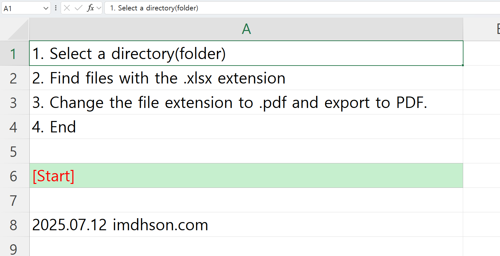

# Excel XLSX to PDF Batch Converter

## 📥 **Download**

[](xlsx_To_PDF[imdhson].xlsm)

[](https://github.com/imdhson/XlsxToPDF_BuiltIn/releases)

**💾 File Name:** `xlsx to PDF[imdhson].xlsm` • **📊 Excel Macro File** • **🔒 Secure Local Conversion**

---



## Introduction

This is a VBA macro tool designed for batch converting Excel XLSX files to PDF. It addresses the privacy risks and performance bottlenecks associated with online conversion tools. By leveraging Excel's native PDF conversion feature, this tool allows you to securely and rapidly process multiple files on your local machine.

## Motivation
- To address privacy and security concerns associated with online PDF conversion tools.
- To enable fast, local batch processing of files.
- To minimize external dependencies by utilizing Excel's built-in conversion capabilities.
- To improve the efficiency of handling multiple file conversions.

## Installation and Setup

### 1. Requirements
- Microsoft Excel (a version that supports macros)
- Windows Operating System

### 2. File Download
Download the [`xlsx to PDF[imdhson].xlsm`](xlsx_To_PDF[imdhson].xlsm) file.

### 3. Enable Macros
Enable macros when prompted upon opening the file in Excel.

### 4. Getting Started
Open the Excel file and click the **[Start Conversion]** cell to begin the process.

## Key Features

- **Batch Conversion**: Converts all XLSX files within a selected folder in a single operation.
- **Local Processing**: Operates securely on your local machine without needing an internet connection.
- **Native Excel Conversion**: Uses the `ExportAsFixedFormat` function for high-quality conversions.
- **Simple Interface**: An intuitive user experience—just click a cell to start.
- **Automatic File Naming**: Creates PDFs with the same name as the source file, only changing the extension.

## How to Use

### 1. Starting the Conversion
1. Open the `xlsx to PDF[imdhson].xlsm` file with Excel.
2. Click the **[Start Conversion]** cell.
3. In the folder selection dialog, choose the folder containing the XLSX files you want to convert.

### 2. The Conversion Process
- The tool automatically finds all `.xlsx` files in the selected folder.
- It sequentially opens each file and converts it to PDF.
- The resulting PDF file is saved in the same folder with the same name.
- A confirmation message appears upon completion.

### 3. Important Notes
- **Subfolders are not supported**: Only files directly within the selected folder will be converted.
- During the conversion, Excel's screen updating is disabled to improve performance.

## Core VBA Code

### Main Conversion Function
```vba
Sub Batch_Export_XLSX_to_PDF()
    Dim folderPath As String
    Dim fileName As String
    Dim wb As Workbook

    With Application.FileDialog(msoFileDialogFolderPicker)
        .Title = "Select a directory with .xlsx"
        If .Show = -1 Then
            folderPath = .SelectedItems(1) & "\"
        Else
            Exit Sub
        End If
    End With

    fileName = Dir(folderPath & "*.xlsx")
    Application.ScreenUpdating = False

    Do While fileName <> ""
        Set wb = Workbooks.Open(folderPath & fileName)
        wb.ExportAsFixedFormat Type:=xlTypePDF, fileName:=folderPath & Replace(fileName, ".xlsx", ".pdf")
        wb.Close False
        fileName = Dir
    Loop

    Application.ScreenUpdating = True
    MsgBox "Export complete Thank you. imdhson.com"
End Sub
```

### Cell Click Event
```vba
Private Sub Worksheet_SelectionChange(ByVal Target As Range)
    If Target.Address = "$A$1" Then
        Call Batch_Export_XLSX_to_PDF
    ElseIf Target.Address = "$A$2" Then
        Call Batch_Export_XLSX_to_PDF
    End If
End Sub
```

## Technical Features

- **ExportAsFixedFormat**: Uses Excel's official `ExportAsFixedFormat` API for PDF conversion.
- **Batch Processing**: Efficiently iterates through files using the `Dir` function.
- **User-Friendly**: Intuitive folder selection through the `FileDialog` object.
- **Performance Optimization**: Disables `ScreenUpdating` to speed up the conversion process.

## License

This project is distributed under the [MIT License](LICENSE.md).
It is free to use for both personal and commercial purposes.

## Contact

**Developer**: Donghwi Son

- **Email**: mail@imdhson.com
- **Instagram**: @imdhson
- **GitHub**: [https://github.com/imdhson](https://github.com/imdhson)
- **Website**: http://imdhson.com